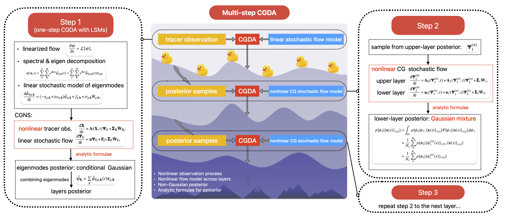

# Code for the paper "A Closed-Form Nonlinear Data Assimilation Algorithm for Multi-Layer Flow Fields" ##

## Structure
1. Generate QG simulations as the reference run ("truth"): [run_twolayer_qgtopo.m](./code/qg_2layer_topo).
2. Reproduce results and figures of paper: [MultistepDA.ipynb](./code). The computation demanding DA tasks are independent python scripts: [da_tracerobs.py](./code) for tracer observations and [da_flowobs.py](./code) for the upper-layer flow fully observed case.
3. The [data](./data) folder includes the example data for a short integration time of QG, which is used for the computational cost analysis.

## Paper
paper in preparation.
